# SISOP IT-06

Repository ini berisi hasil pengerjaan Praktikum Sistem Operasi 2025 Modul 1

| Nama                     | Nrp        |
| ------------------------ | ---------- |
| Paundra Pujo Darmawan    | 5027241008 |
| Putri Joselina Silitonga | 5027241116 |

### Soal 1 (Putri Joselina Silitonga)

Di sebuah desa kecil yang dikelilingi bukit hijau, Poppo dan Siroyo, dua sahabat karib, sering duduk di bawah pohon tua sambil membayangkan petualangan besar. Poppo, yang ceria dan penuh semangat, baru menemukan kesenangan dalam dunia buku, sementara Siroyo, dengan otaknya yang tajam, suka menganalisis segala hal. Suatu hari, mereka menemukan tablet ajaib berisi catatan misterius bernama reading_data.csv. Dengan bantuan keajaiban awk, mereka memutuskan untuk menjelajahi rahasia di balik data itu, siap menghadapi tantangan demi tantangan dalam petualangan baru mereka.

**a. Bantu Poppo menghitung jumlah baris di tablet ajaib yang menunjukkan buku-buku yang dibaca oleh Chris Hemsworth.**

```bash
awk -F',' '$2 == "Chris Hemsworth" {count++} END {print "Chris Hemsworth membaca", count, "buku."}' reading_data.csv
```

-F',' → Menetapkan pemisah kolom sebagai koma (CSV format).

'$2 == "Chris Hemsworth"' → Mengecek apakah kolom kedua berisi "Chris Hemsworth".

{count++} → Menghitung jumlah baris yang cocok.

END {print "Chris Hemsworth membaca", count, "buku."} → Menampilkan hasil setelah semua baris diproses.

**b. Bantu Siroyo untuk menghitung rata-rata durasi membaca (Reading_Duration_Minutes) untuk buku-buku yang dibaca menggunakan “Tablet”**

```bash
awk -F, 'NR>1 && $8 == "Tablet" { sum += $6; count++ } END { if (count > 0) print "Rata-rata durasi membaca dengan Tablet adalah", sum / count, "menit."; else print "Tidak ada data."; }' reading_data.csv
```

'NR>1 && $8 == "Tablet"' →
NR>1 → Melewati baris pertama ( header).

$8 == "Tablet" → Memilih hanya baris yang di kolom ke-8 berisi "Tablet".

{ sum += $6; count++ } →
Menjumlahkan nilai di kolom ke-6 (durasi membaca).

END { if (count > 0) ... } →
Jika ada data (count > 0), hitung rata-rata sum / count dan cetak hasil.
Jika tidak ada data, cetak "Tidak ada data.".

**c.Siapa yang memberikan rating tertinggi untuk buku yang dibaca (Rating) beserta nama (Name) dan judul bukunya (Book_Title).**

```bash
awk -F, 'NR>1 {                                if ($7 > max) {
        max = $7
        title = $3
        reader = $2
    }                                                                                                     }
END {
    if (max > 0)
        print "Pembaca dengan rating tertinggi:", reader, "-", title, "-", max
    else
        print "Tidak ada data."
}' reading_data.csv
```

NR>1 → Melewati baris pertama (header).

Membandingkan rating tertinggi di kolom ke-7 ($7).

Jika ditemukan rating lebih tinggi, simpan rating, judul buku, dan nama pembaca.
Setelah semua data dibaca, cetak hasilnya.

d. **Bantu Siroyo menganalisis data untuk menemukan genre yang paling sering dibaca di Asia setelah 31 Desember 2023, beserta jumlahnya, agar laporannya jadi yang terbaik di klub**

```bash
awk -F, '
$5 > "2023-12-31" && $9 == "Asia" { genre_count[$4]++ }
END {
    for (genre in genre_count)
        print genre, genre_count[genre]
}' reading_data.csv | sort -k2 -nr | head -n1 | awk '{print "Genre paling populer di Asia setelah 2023 adalah", $1, "dengan", $2, "buku."}'
```

Pilih hanya buku yang dibaca setelah 31 Desember 2023 ($5 > "2023-12-31").
Hanya untuk pembaca dari Asia ($9 == "Asia").

Simpan dalam array genre_count[$4]++.
Urutkan dan ambil genre terbanyak

sort -k2 -nr → Urutkan berdasarkan jumlah buku (terbanyak ke terkecil).

head -n1 → Ambil genre dengan jumlah buku terbanyak.

**Output 1A**  
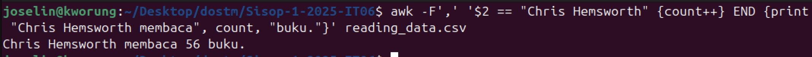

**Output 1B**  
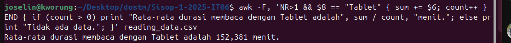

**Output 1C**  
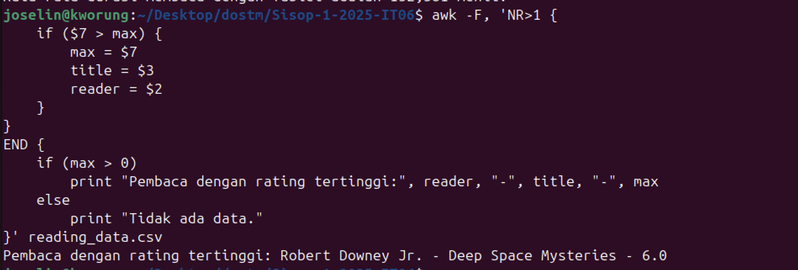

**Output 1D**  
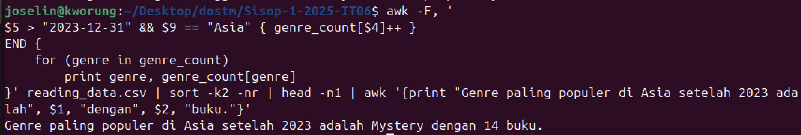

### Soal 2 (Paundra Pujo Darmawan)

Jadi untuk soal ini objektif nya adalah membuat sebuah aplikasi monitoring RAM dan CPU pada perangkat kita. Pada menu awal diharuskan untuk login, dan jika belum login harus melakukan register dahulu dengan beberapa ketentuan, yaitu:

- Email harus memiliki pola aaaa@bbb.ccc
  Contoh: pujo@gmail.com
- Email harus unik, jadi jika sudah ada email yang terdaftar di database, maka email tersebut tidak bisa digunakan untuk register lagi.
- Password harus mengandung lebih dari atau sama dengan 8.
- Password harus di hash menggunakan sha256

Pada fitur diatas, dapat di implementasikan menjadi beberapa fungsi:

- Pola email:

  ```shell
  validate_email() {
      local email=$1
      if [[ "$email" =~ ^[a-zA-Z0-9._%+-]+@[a-zA-Z0-9.-]+\.[a-zA-Z]{2,}$ ]]; then
          return 0
      else
          return 1
      fi
  }
  ```

- Cek email di database:

  ```shell
  email_exists() {
      local email=$1
      if grep -q "^.*,$email,.*$" "$CSV_FILE"; then
          return 0  # Email exists
      else
          return 1  # Email does not exist
      fi
  }
  ```

- Cek panjang password:

  ```shell
  validate_password() {
      local password=$1
      if [[ ${#password} -ge 8 ]]; then
          return 0
      else
          return 1
      fi
  }
  ```

- Hash password:
  `shell
local saved_password
saved_password=$(echo -n "$password" | sha256sum | awk '{print $1}')
`
  Setelah melewati semua validasi diatas, maka user akan masuk ke database dan dapat login ke sistem.

```shell
    echo "$name,$email,$saved_password" >> "$CSV_FILE"
    echo "✅ Registration successful!"
    return 0
```

Setelah berhasil register, kita dapat login kedalam sistem dengan email dan password yang sudah dimasukkan.

```shell
    local password_hash
    password_hash=$(echo -n "$password" | sha256sum | awk '{print $1}')

    while IFS=',' read -r name email_in file_password; do
        if [[ "$email" == "$email_in" && "$password_hash" == "$file_password" ]]; then
            echo "✅ Login successful!"
            return 0
        fi
    done < <(tail -n +2 "$CSV_FILE")
```

Dan setelah berhasil login, user dapat melihat _CPU Usage_ dan juga _Ram Usage_. Selain itu, user juga bisa untuk merecord Ram dan CPU Usage tersebut mengunakan crontab. Dimana fitur tersebut tersedia pada opsi Crontab Manager di terminal utama.

Pada Crontab Manager, tersedia dua fungsi utama, yaitu core monitor dan juga fragment monitor.

Pada kode dibawah ini, berguna untuk mengecek CPU model dan juga CPU usage yang ada di hardware/laptop.

```shell
    CPU_MODEL=$(sysctl -n machdep.cpu.brand_string)
    TIMESTAMP=$(date "+%Y-%m-%d %H:%M:%S")

    CPU_USAGE=$(top -l 1 | grep "CPU usage" | awk '{print $3}' | tr -d '%')
```

Dan pada kode dibawah ini digunakan untuk menghitung RAM usage.

```shell
RAM_TOTAL=$(sysctl -n hw.memsize)
RAM_TOTAL_MB=$((RAM_TOTAL / 1024 / 1024))
RAM_FREE=$(vm_stat | awk '/Pages free/ {print $3}' | sed 's/\.//')
RAM_FREE_MB=$((RAM_FREE * 4096 / 1024 / 1024))
RAM_USED_MB=$((RAM_TOTAL_MB - RAM_FREE_MB))
RAM_USAGE_PERCENT=$(( RAM_USED_MB * 100 / RAM_TOTAL_MB ))

```

##### Fitur register


##### Fitur login


##### Fitur CPU monitoring

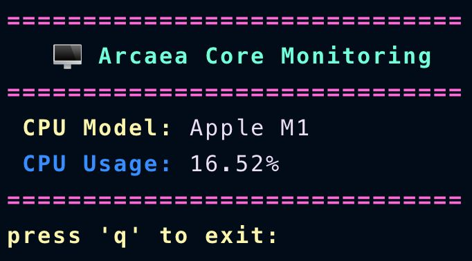

##### Fitur RAM monitoring

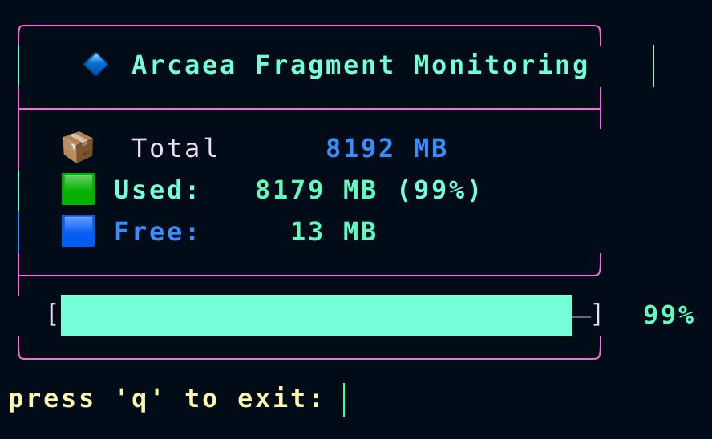

##### Crontab Manager

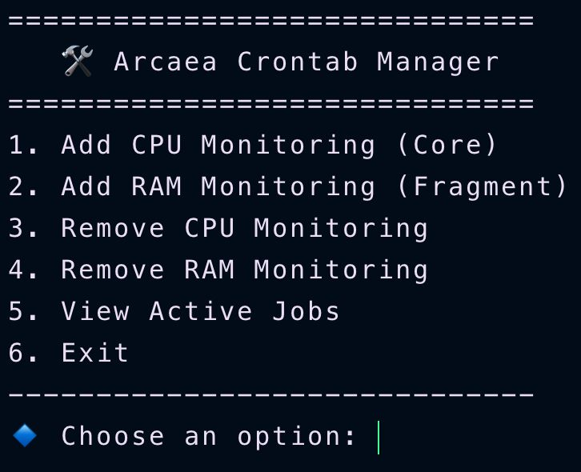

### Soal 3 (Putri Joselina Silitonga)

Untuk merayakan ulang tahun ke 52 album The Dark Side of the Moon, tim PR Pink Floyd mengadakan sebuah lomba dimana peserta diminta untuk membuat sebuah script bertemakan setidaknya 5 dari 10 lagu dalam album tersebut. Sebagai salah satu peserta, kamu memutuskan untuk memilih Speak to Me, On the Run, Time, Money, dan Brain Damage. Saat program ini dijalankan, terminal harus dibersihkan terlebih dahulu agar tidak mengganggu tampilan dari fungsi fungsi yang kamu buat. Program ini dijalankan dengan cara ./dsotm.sh --play=”<Track>” dengan Track sebagai nama nama lagu yang kamu pilih.

**a.Speak to Me**

```bash
speak_to_me() {
    while true; do
        curl -s https://www.affirmations.dev | awk -F'"' '{print $4}'
        sleep 1
    done
}
```

while true; do → Loop tak terbatas (berjalan terus-menerus).
curl -s https://www.affirmations.dev →
Mengambil data dari API afirmasi positif.

-s (silent) agar tidak menampilkan log tambahan.

awk -F'"' '{print $4}' →
Memproses JSON output API untuk mengambil teks afirmasi.
$4 mengambil teks di antara tanda kutip kedua ("affirmation": "..." → hanya "...").

sleep 1 → Menunggu 1 detik sebelum mengambil afirmasi berikutnya.

b. On_the_run

```bash
on_the_run() {
    bar_length=200
    progress=0
    while [ $progress -le $bar_length ]; do
        clear
        echo "*** On the Run ***"
        echo -n "["
        for ((i = 0; i < progress; i++)); do echo -n "*"; done
        for ((i = progress; i < bar_length; i++)); do echo -n " "; done
        echo "] $(($progress * 100 / $bar_length))%"
        progress=$((progress + 1))
        sleep 0.2
    done
}
```

bar_length=200 → Panjang total progress bar.

progress=0 → Menyimpan nilai progres saat ini.
Looping untuk Menampilkan Progress Bar

while [ $progress -le $bar_length ]; do → Selama nilai progress masih lebih kecil atau sama dengan bar_length, jalankan loop.

echo "**_ On the Run _**" → Menampilkan judul.

echo -n "[" → Menampilkan tanda awal progress bar.

Bintang \* sebanyak progress → Menggunakan for ((i = 0; i < progress; i++)).

Spasi sisa bar → Menggunakan for ((i = progress; i < bar_length; i++)).

Menampilkan persentase kemajuan → $(($progress \* 100 / $bar_length))%.

progress=$((progress + 1)) → Menambah nilai progress setiap iterasi.
sleep 0.2 → Memberi jeda 0.2 detik agar animasi terlihat lebih nyata.
c. Time Display

```bash
time_display() {
    while true; do
        clear
        echo "~~~ Time ~~~"
        date "+%Y-%m-%d %H:%M:%S"
        sleep 1
    done
}
```

Loop tanpa henti (while true; do) memastikan fungsi berjalan terus.

clear membersihkan layar agar hanya tampilan terbaru yang terlihat.
Menampilkan header "~~~ Time ~~~".

Menampilkan waktu saat ini dengan format YYYY-MM-DD HH:MM:SS

d. Money

```bash money() {
    symbols=('$' '€' '£' '¥' '¢' 'K' 'A' 'W' 'O' 'R' 'U' '𓆩♡𓆪')
    cols=$(tput cols)
    lines=$(tput lines)

    tput civis
    clear

    while true; do
        if [ "$lines" -eq 0 ] || [ "$cols" -eq 0 ]; then
            exit 1
        fi

        row=$((RANDOM % lines))
        col=$((RANDOM % cols))
        symbol="${symbols[RANDOM % ${#symbols[@]}]}"
        color=$((RANDOM % 256))

        tput cup "$row" "$col"
        echo -ne "\e[38;5;${color}m${symbol}\e[0m"

        sleep 0.05
    done
}
```

Menyimpan simbol dalam array (symbols).

Mengambil ukuran terminal (tput cols & tput lines).

Menyembunyikan kursor (tput civis) dan membersihkan layar (clear).

Loop tanpa henti:
Memilih posisi acak (row & col).dan memilih simbol acak dari array.
Memilih warna acak (color).

Menampilkan simbol di posisi tersebut dengan warna acak.

Jeda 0.05 detik sebelum mengulang.

e. Brain Damage

```bash
brain_damage() {
   while true; do
       clear
       echo -e "\e[1;35m------ Brain Damage ------\e[0m"
       echo -e "\e[1;33mWaktu:\e[0m $(date '+%H:%M:%S')"
       echo -e "\e[1;33mLoad Average:\e[0m $(uptime | awk -F'load average:' '{print $2}')"
       echo -e "\e[1;33mTasks:\e[0m $(ps -eo stat | grep -c '^R') running, $(ps -eo stat | grep -c '^S') sleeping"
       echo -e "\e[1;34m====================================\e[0m"
       echo -e "\e[1;36mPID   USER      PR  NI    VIRT   RES  %CPU %MEM  TIME+ COMMAND\e[0m"

       ps -eo pid,user,pri,ni,vsize,rss,pcpu,pmem,time,comm --sort=-%cpu | head -15 | while read -r pid user pri ni vsize rss pcpu pmem time comm; do
           printf "\e[1;37m%-6s %-8s %-3s %-3s %-8s %-6s %-4s %-4s %-8s %-s\e[0m\n" "$pid" "$user" "$pri" "$ni" "$vsize" "$rss" "$pcpu" "$pmem" "$time" "$comm"
       done

       sleep 2
   done
}
```

while true; do
→ Looping tanpa henti hingga dihentikan (Ctrl + C).

clear
→ Membersihkan layar sebelum update.

echo -e "\e[1;35m------ Brain Damage ------\e[0m"
→ Menampilkan judul berwarna ungu.

echo -e "\e[1;33mWaktu:\e[0m $(date '+%H:%M:%S')"
→ Menampilkan waktu saat ini (HH:MM:SS).

echo -e "\e[1;33mLoad Average:\e[0m $(uptime | awk -F'load average:' '{print $2}')"
→ Menampilkan beban sistem terbaru.

ps -eo pid,user,pri,ni,vsize,rss,pcpu,pmem,time,comm --sort=-%cpu | head -15
→ Menampilkan 15 proses dengan penggunaan CPU tertinggi.

sleep 2
→ Menunggu 2 detik sebelum refresh.

```bash
case "$1" in
    --play="Speak to Me") speak_to_me ;;
    --play="On the Run") on_the_run ;;
    --play="Time") time_display ;;
    --play="Money") money ;;
    --play="Brain Damage") brain_damage ;;
    *)
        echo "Usage: $0 --play=\"<Track>\""
        echo "Available Tracks: Speak to Me, On the Run, Time, Money, Brain Damage"
        exit 1
        ;;
esac
```

case "$1" in
→ Mengecek nilai argumen pertama ($1).

--play="Speak to Me") speak_to_me sampai brain_damage
→ Jika argumen cocok, jalankan fungsi terkait.

    echo "Usage: $0 --play=\"<Track>\""
    echo "Available Tracks: Speak to Me, On the Run, Time, Money, Brain Damage"
    exit 1
    ;;

→ Jika tidak cocok, tampilkan pesan bantuan lalu keluar.

**Output 3A**  
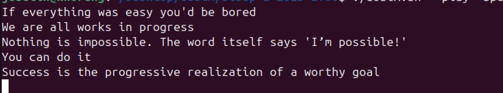  
**Output 3B**
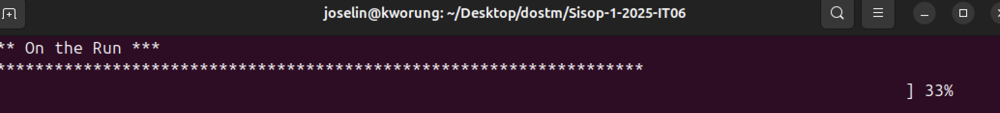  
**Output 3C**
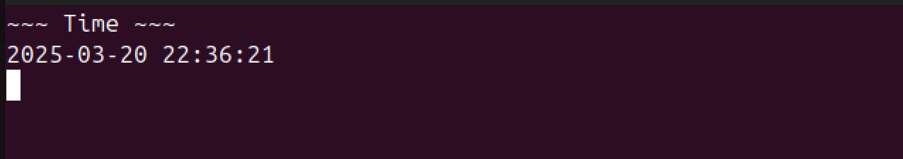  
**Output 3D**
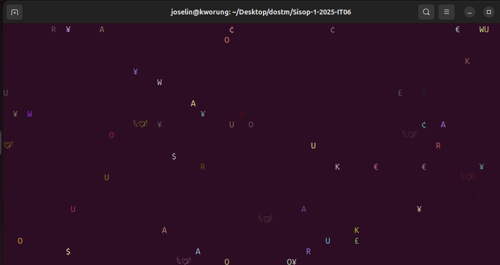  
**Output 3E**
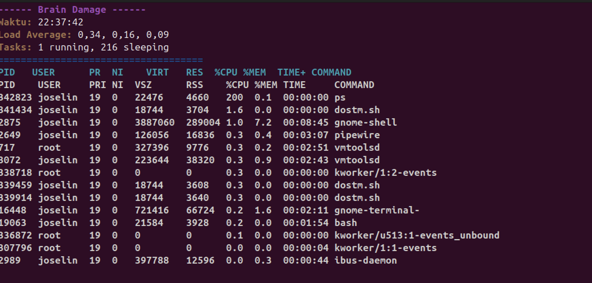

### Soal 4 (Paundra Pujo Darmawan)

Pada soal terakhir ini, kita ditugaskan untuk membuat program analisa pokemon. Dimana program tersebut memiliki beberapa objektif. 

1. Melihat summary data

```shell
info() {
    local file="$1"
    highest_usage=$(sort -t, -k2 -n -r "$file" | head -n 1 | cut -d, -f1,2)
    highest_raw_usage=$(sort -t, -k3 -n -r "$file" | head -n 1 | cut -d, -f1,3)
    echo "Summary of pokemon_usage.csv"
    echo "Highest Adjusted Usage: $highest_usage"
    echo "Highest Raw Usage: $highest_raw_usage"
}
```
Dimana pada kode diatas, kita menggunakan sort untuk mengurutkan value dari usage dan raw usage, dan menggunakan head untuk mengambil nilai teratas, serta menggunakan cut untuk mengambil nilai dari usage serta raw usage.

2. Mengurutkan kolom berdasarkan data kolom

```shell
sort_data() {
    local file="$1"
    local sort_by="$2"
    case $sort_by in
        usage)
            sort_column=2
            ;;
        rawusage)
            sort_column=3
            ;;
        hp)
            sort_column=6
            ;;
        atk)
            sort_column=7
            ;;
        def)
            sort_column=8
            ;;
        spatk)
            sort_column=9
            ;;
        spdef)
            sort_column=10
            ;;
        speed)
            sort_column=11
            ;;
        *)
            echo "Error: invalid sort option"
            exit 1
            ;;
    esac
    sort -t, -k"$sort_column" -n -r "$file"
}
```

Pada kode diatas, fungsi paling utama adalah di paling bawah, `sort -t, -k"$sort_column" -n -r "$file"`. Dimana itu berfungsi untuk mengurutkan data berdasarkan kolom yang dipilih.

3. Mencari nama pokemon tertentu
```shell
grep_pokemon() {
    local file="$1"
    local search="$2"
    grep -i "$search" "$file" | sort -t, -k2 -n -r
}
```
Kode diatas berfungsi untuk mengambil pokemon dengan menggunakan command grep.

4. Mencari pokemon berdasarkan filter tipe nama
```shell
filter_by_type() {
    local file="$1"
    local type="$2"
    grep -i "$type" "$file" | sort -t, -k2 -n -r
}
```
Sama seperti mencari nama pokemon, kode ini juga mengambil dan menampilkan pokemon dengan tipe tertentu.

5. Error handling
```shell
if [[ $# -lt 2 ]]; then
        echo "Error: no option provided"
        echo "Use -h or --help for more information"
        exit 1
    fi
```
Potongan kode diatas adalah untung menangani error ketika user salah memberikan argumen.

6. Help screen yang menarik
```shell
display_ascii_art() {
    cat << "EOF"

 ____   ___  _  _______ __  __  ___  _   _ 
|  _ \ / _ \| |/ / ____|  \/  |/ _ \| \ | |
| |_) | | | | ' /|  _| | |\/| | | | |  \| |
|  __/| |_| | . \| |___| |  | | |_| | |\  |
|_|    \___/|_|\_\_____|_|  |_|\___/|_| \_|

EOF
}
```

```shell
help_screen() {
    display_ascii_art
    echo "Usage: ./pokemon_analysis.sh <file> [options]"
    echo ""
    echo "Options:"
    echo "  --info                Show the summary of the CSV file"
    echo "  --sort <column>       Sort the data by the specified column (usage, rawusage, hp, atk, def, spatk, spdef, speed)"
    echo "  --grep <pokemon>      Search for a specific Pokemon by name"
    echo "  --filter <type>       Filter Pokemon by type"
    echo "  -h, --help            Display this help message"
    echo ""
    echo "Example usage:"
    echo "  ./pokemon_analysis.sh pokemon_usage.csv --info"
    echo "  ./pokemon_analysis.sh pokemon_usage.csv --sort usage"
    echo "  ./pokemon_analysis.sh pokemon_usage.csv --grep rotom"
    echo "  ./pokemon_analysis.sh pokemon_usage.csv --filter dark"
}
```
Fungsi diatas untuk menampilkan help screen yang menarik.


##### Fitur summary data

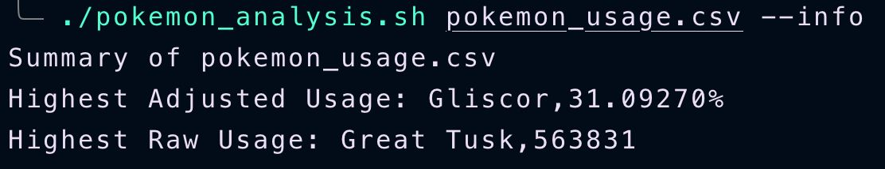

##### Fitur sorting
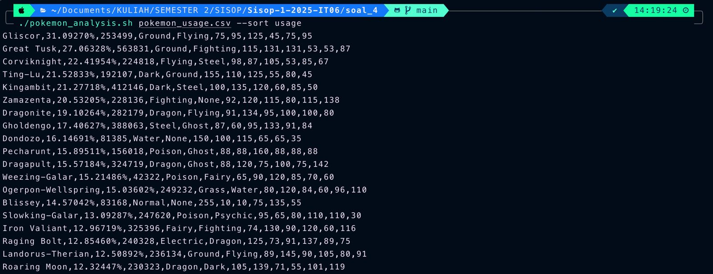

##### Fitur search pokemon
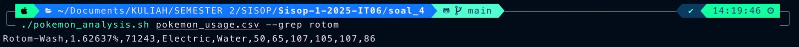

##### Fitur filter berdasarkan tipe
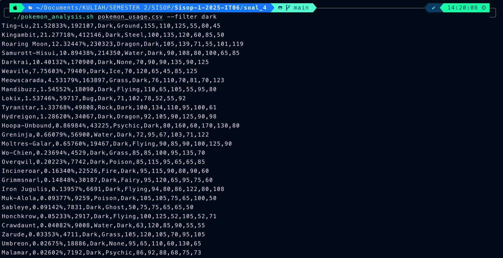

##### Fitur error handling 
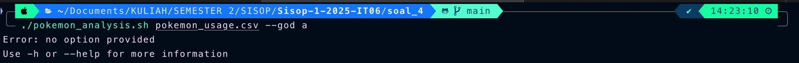

##### Fitur help screen
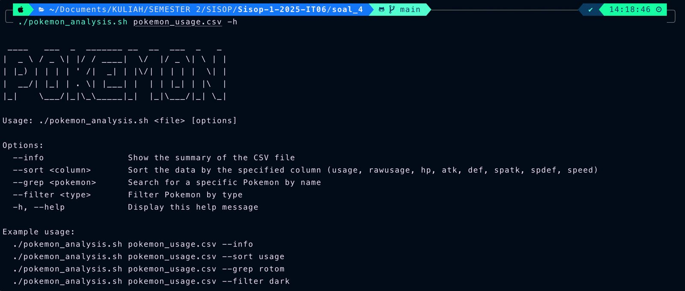
