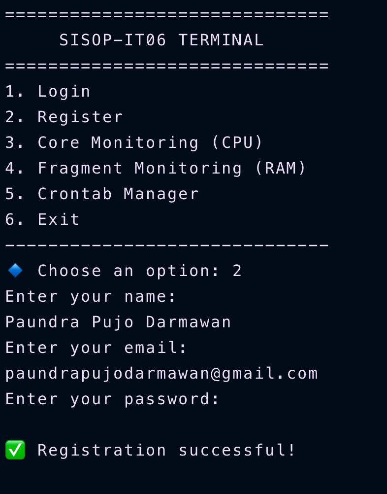
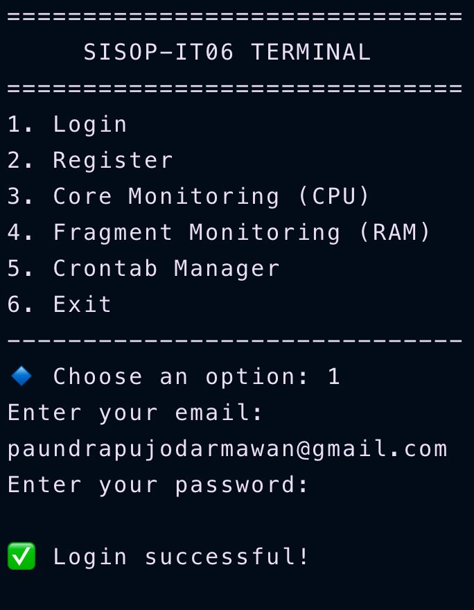

# SISOP IT-06

Repository ini berisi hasil pengerjaan Praktikum Sistem Operasi 2025 Modul 1

| Nama                     | Nrp        |
| ------------------------ | ---------- |
| Paundra Pujo Darmawan    | 5027241008 |
| Putri Joselina Silitonga | 5027241116 |

### Soal 2 (Paundra Pujo Darmawan)

Jadi untuk soal ini objektif nya adalah membuat sebuah aplikasi monitoring RAM dan CPU pada perangkat kita. Pada menu awal diharuskan untuk login, dan jika belum login harus melakukan register dahulu dengan beberapa ketentuan, yaitu:

- Email harus memiliki pola aaaa@bbb.ccc
  Contoh: pujo@gmail.com
- Email harus unik, jadi jika sudah ada email yang terdaftar di database, maka email tersebut tidak bisa digunakan untuk register lagi.
- Password harus mengandung lebih dari atau sama dengan 8.
- Password harus di hash menggunakan sha256

Pada fitur diatas, dapat di implementasikan menjadi beberapa fungsi:

- Pola email:

  ```shell
  validate_email() {
      local email=$1
      if [[ "$email" =~ ^[a-zA-Z0-9._%+-]+@[a-zA-Z0-9.-]+\.[a-zA-Z]{2,}$ ]]; then
          return 0
      else
          return 1
      fi
  }
  ```

- Cek email di database:

  ```shell
  email_exists() {
      local email=$1
      if grep -q "^.*,$email,.*$" "$CSV_FILE"; then
          return 0  # Email exists
      else
          return 1  # Email does not exist
      fi
  }
  ```

- Cek panjang password:

  ```shell
  validate_password() {
      local password=$1
      if [[ ${#password} -ge 8 ]]; then
          return 0
      else
          return 1
      fi
  }
  ```

- Hash password:
  `shell
local saved_password
saved_password=$(echo -n "$password" | sha256sum | awk '{print $1}')
`
  Setelah melewati semua validasi diatas, maka user akan masuk ke database dan dapat login ke sistem.

```shell
    echo "$name,$email,$saved_password" >> "$CSV_FILE"
    echo "✅ Registration successful!"
    return 0
```

Setelah berhasil register, kita dapat login kedalam sistem dengan email dan password yang sudah dimasukkan.

```shell
    local password_hash
    password_hash=$(echo -n "$password" | sha256sum | awk '{print $1}')

    while IFS=',' read -r name email_in file_password; do
        if [[ "$email" == "$email_in" && "$password_hash" == "$file_password" ]]; then
            echo "✅ Login successful!"
            return 0
        fi
    done < <(tail -n +2 "$CSV_FILE")
```

##### Fitur register

##### Fitur login


